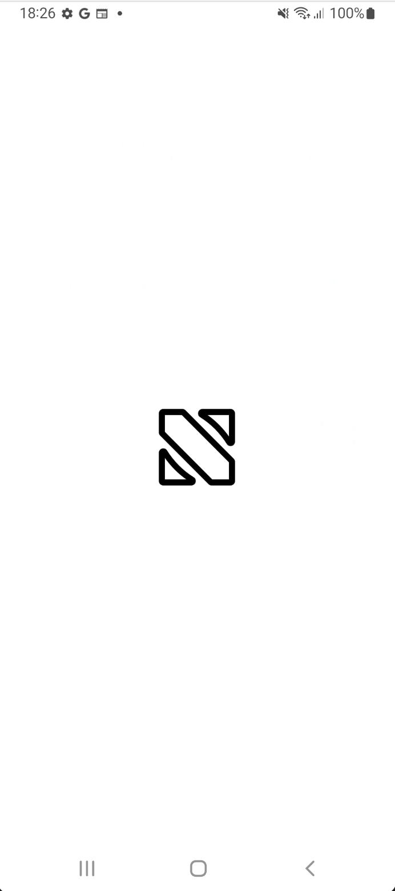
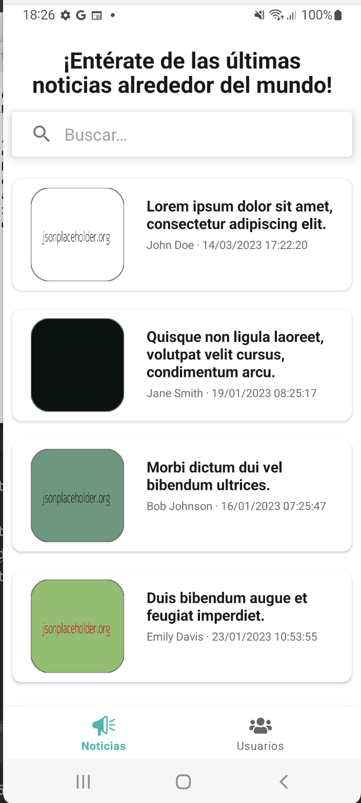
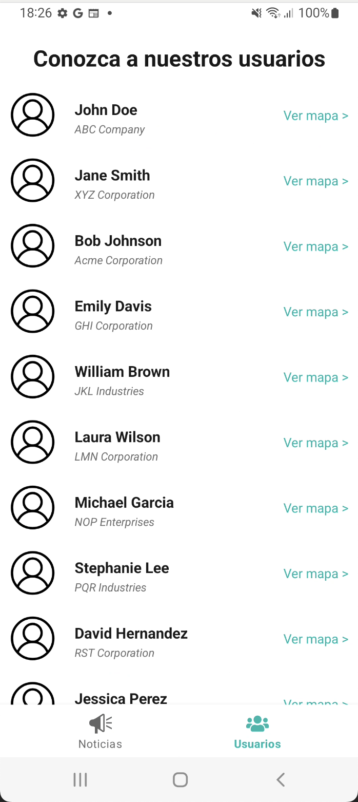
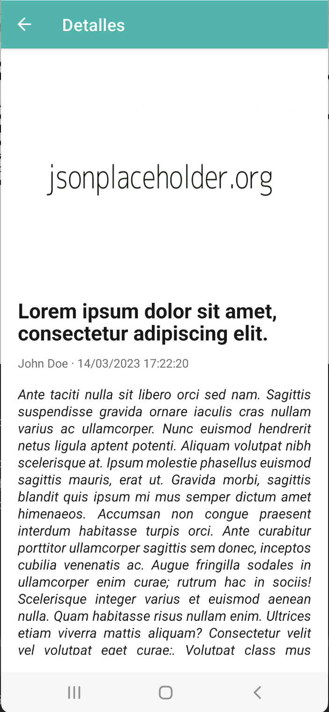
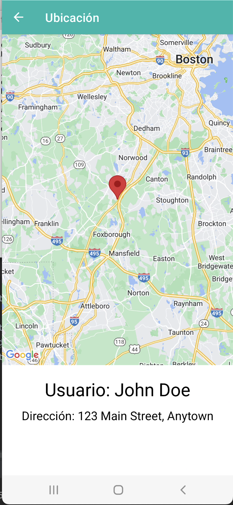

# NewsApp

### Contenido
* [Introduccion](#introduccion)
* [Conceptos aplicados](#conceptos-aplicados)
* [Herramientas y bibliotecas utilizadas](#herramientas-y-bibliotecas-utilizadas)
* [Screenshots](#screenshots)

### Introduccion
NewsApp es una aplicación móvil nativa que permite visualizar información detallada de noticias,
así como también, los usuarios que hayan publicado alguna noticia.
La información es traída desde la API pública JSONPlaceholder.

### Conceptos aplicados
* Clean Architecture (basado en las 3 capas principales de presentación, dominio y datos)
* Principios SOLID aplicados a lo largo del proyecto.
* Dependency injection
* Patrón MVVM para la capa de presentación
* Patrón Repository para la capa de datos
* Patrón Observer (reactivo) para determinar el comportamiento de la UI en base a la respuesta de
  los use cases.
* Patrón Adapter para la implementación de recycler view para la lista de noticias y usuarios.

### Herramientas y bibliotecas utilizadas
* Hilt para DI
* Coroutines y flows para la programación asíncrona/reactiva
* Retrofit para la comunicación con la API
* Picasso para la carga de las imágenes.
* JUnit4 y MockK para el Unit testing
* Room DB para la base de datos local del usuario
* Google Map SDK para mostrar la ubicación del usuario.
* El framework de Navigation  para la navegación entre fragments.
* Gson para la conversión de datos a JSON para su uso en la base de datos.
* La biblioteca de Splashscreen para una mejor experiencia de usuario.

### Screenshots
* Splash screen 

  

* Lista de noticias 

  

* Lista de usuarios

  

* Detalles de noticia

  

* Ubicación del usuario en el mapa

  
